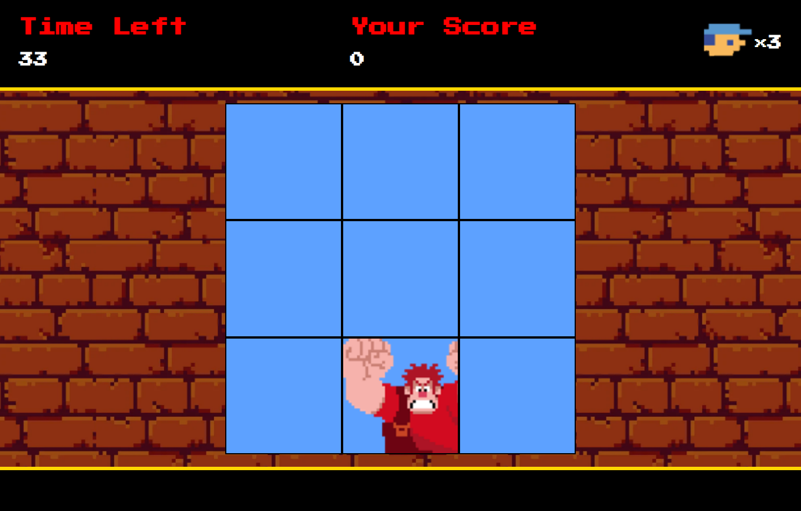

# Game Detona Ralph - DIO

O jogo detona Ralph foi desenvolvido para o aprendizado de HTLM, CSS e JavaScript.

O objetivo deste game é clicar o máximo de vezes que conseguir no detona ralph durante o tempo de 60 segundos, a pontuação aumenta de acordo com os acertos e caso erre, a vida diminui.

 

# **📈 OBJETIVO:**
### 📚 Aprendizado
### 🧠 Conhecimento
### ⭐ Sucesso
 

# **🛠 LINGUAGENS UTILIZADAS:**

  

